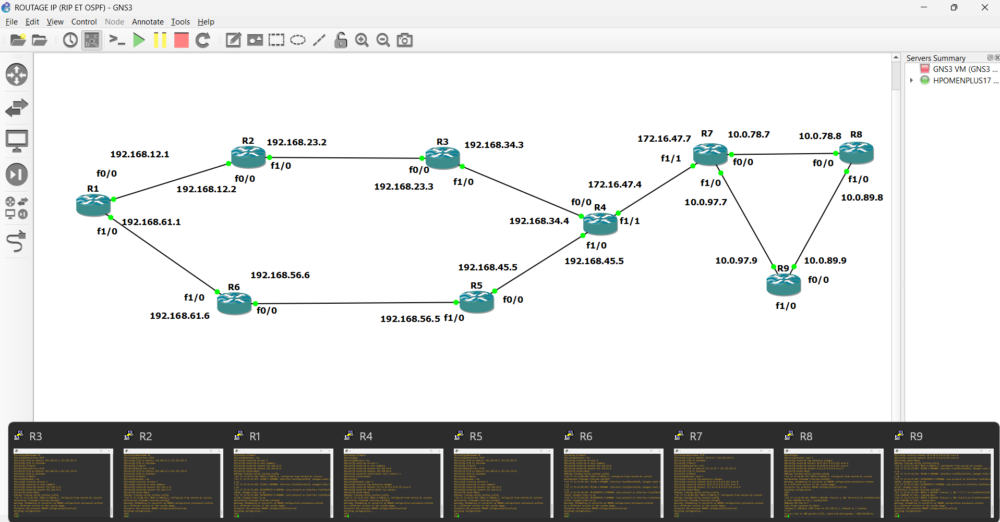

# IP ROUTING RIPV2 & OSPF WITH GNS3
Implementation and comparison of RIPv2 and OSPF dynamic routing protocols in a simulated enterprise network using Cisco routers
# IP Routing Lab - RIPv2 & OSPF

## Overview

This project demonstrates the implementation of two dynamic routing protocols:

- RIPv2
- OSPF

The objective is to configure and compare both protocols in a simulated enterprise network while ensuring full connectivity between multiple LANs.

---

## Objectives

- Configure IPv4 addressing
- Implement RIPv2 routing
- Implement OSPF routing
- Verify end-to-end connectivity
- Analyze routing tables
- Compare convergence and scalability

---

## Technologies

- Cisco IOS
- GNS3
- IPv4
- RIPv2
- OSPF

---

## Features

- Multi-router topology
- Dynamic route propagation
- End-to-end communication
- Routing table verification
- Ping and traceroute validation

---

## Verification

Commands used:

show ip route
show ip protocols
show ip ospf neighbor
show ip ospf database
show running-config
ping
traceroute

## Learning Outcomes

This project helped strengthen practical skills in:

- Dynamic routing
- Cisco IOS configuration
- Enterprise network design
- Routing protocol analysis
- Network troubleshooting

---

## Author

Lucas Ramiandriasoa
Network & Systems Engineering Student
